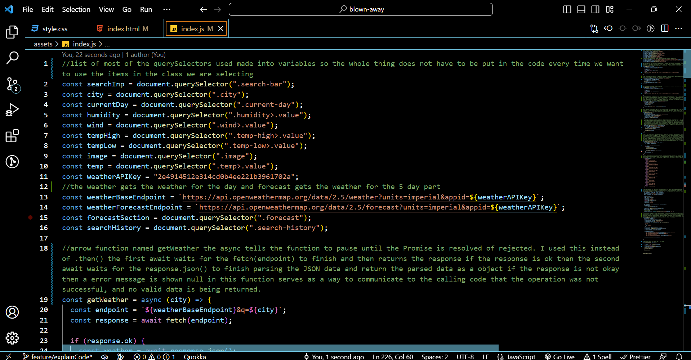
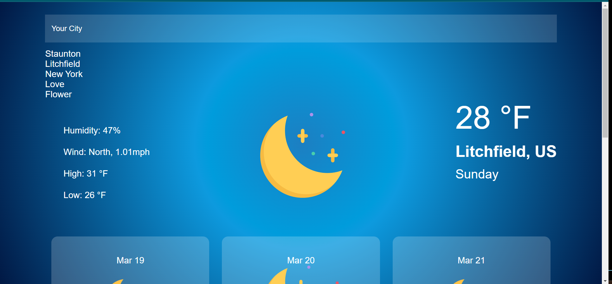

# Blown-Away-weather

I really enjoyed making this application event though it was very challenging it was enjoyable to figure out the solution to the problems. 
## Link to my proud work :
You can see my work has blown it away. Just a bit of humor here is a link to see my work [Blown-Away-weather](https://smiliekay.github.io/Blown-Away-weather/)

## Main Goals 
My goal was to make a weather site that used a weather API to show the current weather as well as the 5 day forecast. I also wanted to be able to display the date , humidity and high and low temp. I wanted to be able to have images that changed with the weather , to be able to search for a city and to have my last 5 searches displayed and clickable so I could go back to previous searches. 
 

 ## Pictures of my work
 
 This was challenging but the end result is worth all the work 

 
 I am proud of the finished product